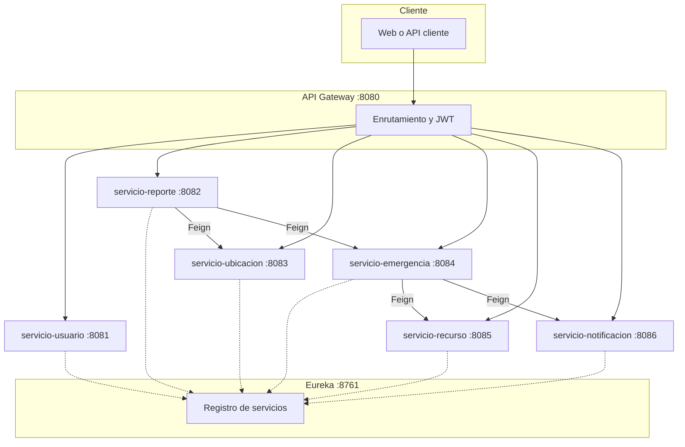
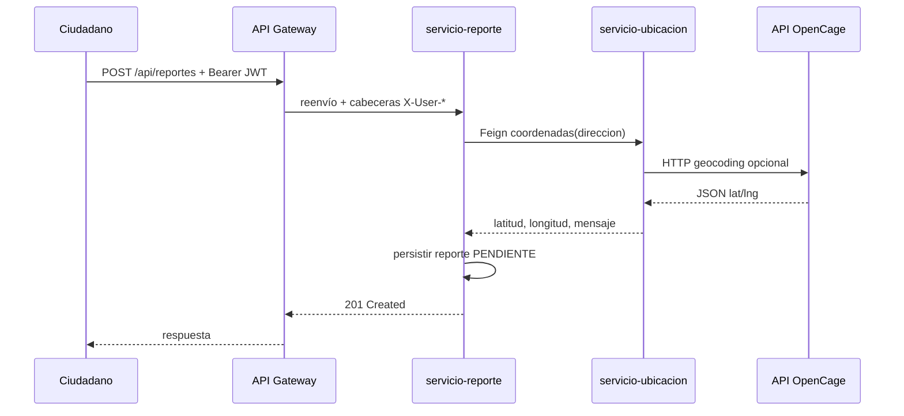
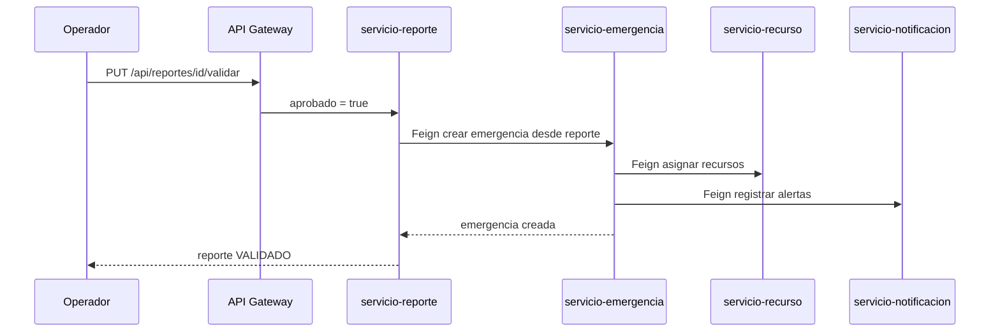
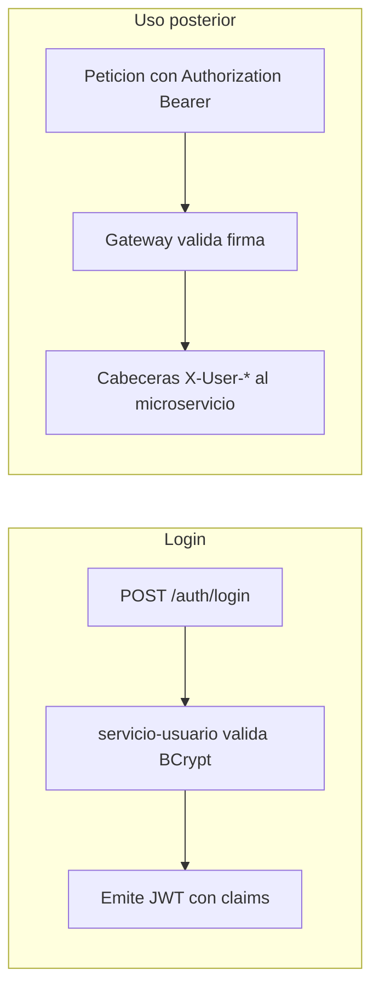

<!-- Portada: al pasar a Word/PDF Duoc, centra el bloque y aplica la fuente que pida la escuela. -->

**DUOC UC**  

**Carrera:** Ingeniería en Informática  

**Asignatura:** Arquitectura de Software  

**Sede / Sección:** *(completar)*  

**Profesor/a:** *(completar)*  

---

# INFORME TÉCNICO — BACKEND

## S.I.G.I  

### Sistema Inteligente de Gestión de Incendios  

### *(Municipalidad Valle del Sol — proyecto académico)*  

**Integrantes**

| Nombre | Rol en el equipo *(opcional)* |
|--------|--------------------------------|
| Hawk Durant | |
| Emilio Jaramillo | |
| Rodrigo Candia | |

**Fecha de entrega:** Mayo 2026  

**Repositorio / código:** carpeta `sigi-backend` del proyecto grupal  

---

## Índice

**1.** Introducción  
&nbsp;&nbsp;**1.1** Contexto y problema abordado  
&nbsp;&nbsp;**1.2** Objetivos del backend en relación al sistema  
&nbsp;&nbsp;**1.3** Alcance de este documento  

**2.** Arquitectura del software  
&nbsp;&nbsp;**2.1** Arquitectura de microservicios (elección y justificación)  
&nbsp;&nbsp;**2.2** API Gateway como fachada y seguridad perimetral  
&nbsp;&nbsp;**2.3** Descubrimiento de servicios con Eureka  
&nbsp;&nbsp;**2.4** Principio database per service y decisión práctica con MySQL  

**3.** Vista de arquitectura y diagramas  
&nbsp;&nbsp;**3.1** Figura 1 — Vista lógica de microservicios  
&nbsp;&nbsp;**3.2** Figura 2 — Flujo de reporte y geocodificación  
&nbsp;&nbsp;**3.3** Figura 3 — Flujo de validación y creación de emergencia  
&nbsp;&nbsp;**3.4** Figura 4 — Autenticación mediante JWT y Gateway  

**4.** Patrones de diseño y buenas prácticas aplicadas  
&nbsp;&nbsp;**4.1** Singleton (contexto Spring)  
&nbsp;&nbsp;**4.2** Repository (persistencia)  
&nbsp;&nbsp;**4.3** DTO (transferencia de datos)  
&nbsp;&nbsp;**4.4** Filter Chain (Gateway)  
&nbsp;&nbsp;**4.5** OpenFeign (cliente declarativo)  
&nbsp;&nbsp;**4.6** Circuit Breaker y fallback (Resilience4j)  
&nbsp;&nbsp;**4.7** Builder (generación de JWT con jjwt)  

**5.** Descripción de microservicios y puertos  

**6.** Seguridad: JWT, BCrypt y propagación de identidad  

**7.** Integración externa: geocodificación OpenCage y variable OPENCAGE_API_KEY  

**8.** Flujos operativos resumidos  

**9.** Estrategia de pruebas (JUnit 5 y Mockito)  

**10.** Despliegue: Docker Compose y Kubernetes (entorno demo)  

**11.** Limitaciones y decisiones explícitas del proyecto  

**12.** Conclusiones  

**Referencias**  

---

*Nota: En una versión impresa en Word o PDF del Duoc, el índice suele llevar número de página alineado a la derecha; en este archivo Markdown las secciones coinciden con los epígrafes siguientes.*

---

## 1. Introducción

### 1.1 Contexto y problema abordado

Este informe presenta el trabajo de **backend** del proyecto **S.I.G.I** (Sistema Inteligente de Gestión de Incendios), planteado como apoyo a una municipalidad ficticia (“Valle del Sol”) para ordenar reportes ciudadanos, validación por operador y coordinación de emergencias. La motivación es simple: hoy mucha información vive en canales informales; nosotros intentamos **centralizar** y **trazar** el flujo en un sistema que se pueda explicar en una defensa oral de arquitectura.

### 1.2 Objetivos del backend en relación al sistema

En línea con lo trabajado en el ramo, los objetivos que perseguimos con esta implementación fueron:

- Exponer una **API REST** coherente con roles (ciudadano, operador, equipo de emergencia, administrador) usando **JWT**.
- Permitir **reportes con dirección y prioridad**, con **geocodificación** cuando la API externa responde.
- Permitir **validación del reporte** y, si corresponde, **crear una emergencia**, **asignar recursos** y **registrar notificaciones**.
- Demostrar **resiliencia básica** cuando falle el servicio de ubicación o la API externa.
- Poder **levantar el sistema** con contenedores y documentar un despliegue tipo **Kubernetes** de ejemplo.

### 1.3 Alcance de este documento

Aquí nos centramos en **backend** (servicios, bases de datos, integración, despliegue). Un front-end o app móvil podría consumir los mismos endpoints vía Gateway; no es el foco de este informe.

---

## 2. Arquitectura del software

### 2.1 Arquitectura de microservicios (elección y justificación)

Elegimos **microservicios** porque el proyecto de la asignatura lo pedía explícitamente y porque nos permitía argumentar **aislamiento de fallos** y **evolución por módulos**. Aun así somos conscientes de que no todo proyecto necesita microservicios: un monolito bien modular es válido; en nuestro caso priorizamos el **mapa arquitectónico** y el **contrato entre equipos** (aunque el “equipo” éramos nosotros tres, cada carpeta del repo actúa como un “bloque” con frontera clara).

Cada servicio es un proceso **Spring Boot** con su puerto y su configuración. No compartimos base de datos entre dominios; cada uno tiene su esquema lógico (ver 2.4).

### 2.2 API Gateway como fachada y seguridad perimetral

El **API Gateway** concentra el ingreso HTTP. Ahí aplica la validación del **JWT** y se agregan cabeceras internas para que los microservicios conozcan usuario y rol sin volver a parsear el token en cada uno (decisión de diseño para la demo; en producción se discutiría mTLS, políticas por red, etc.).

### 2.3 Descubrimiento de servicios con Eureka

**Eureka** actúa como registro: los servicios se **anuncian** al levantar y el Gateway / Feign resuelven por **nombre lógico** (`lb://servicio-reporte`), lo que evita IPs fijas. Eso es útil con Docker porque las direcciones internas cambian al reiniciar contenedores.

### 2.4 Principio database per service y decisión práctica con MySQL

El principio **database per service** dice que cada microservicio debería ser dueño de sus datos. Nosotros usamos **bases distintas** (`db_usuario`, `db_reporte`, etc.). Para no exigir seis motores MySQL en notebooks del curso, en Docker usamos **una instancia MySQL** con un script que crea varias bases. Lo explicamos así en defensa: **separación lógica primero**; separación física después si el contexto lo pide (más cerca de producción).

---

## 3. Vista de arquitectura y diagramas

En esta sección incluimos figuras hechas en notación de diagrama (Mermaid). Si el profesor pide el informe en Word, estas figuras se exportan como imágenes y se numeran igual que abajo.

### 3.1 Figura 1 — Vista lógica de microservicios

**Figura 1.** Arquitectura general del backend S.I.G.I (cliente, Gateway, Eureka y microservicios).

*Fuente: elaboración propia, Mayo 2026.*

### 3.2 Figura 2 — Flujo de reporte y geocodificación

**Figura 2.** Secuencia simplificada: creación de reporte y llamada al servicio de ubicación (con posibilidad de fallback si falla la dependencia).

*Fuente: elaboración propia, Mayo 2026.*

### 3.3 Figura 3 — Flujo de validación y creación de emergencia

**Figura 3.** Cuando el operador aprueba un reporte, se dispara la creación de emergencia y la orquestación hacia recursos y notificaciones.

*Fuente: elaboración propia, Mayo 2026.*

### 3.4 Figura 4 — Autenticación mediante JWT y Gateway

**Figura 4.** El login emite JWT en servicio-usuario; el Gateway valida en rutas protegidas.

*Fuente: elaboración propia, Mayo 2026.*

---

## 4. Patrones de diseño y buenas prácticas aplicadas

### 4.1 Singleton (contexto Spring)

Los servicios que inyectamos (`@Service`, utilidades `@Component`) son **singleton por defecto** en el contenedor Spring. Nos importa para cosas como la utilidad **JWT**: una sola instancia evita inconsistencias con la clave de firma.

### 4.2 Repository (persistencia)

Usamos **Spring Data JPA** (`JpaRepository`) para separar **persistencia** de **lógica de negocio**.

### 4.3 DTO (transferencia de datos)

Los **DTO** evitan exponer entidades completas y campos sensibles (por ejemplo contraseña hasheada).

### 4.4 Filter Chain (Gateway)

El patrón de **cadena de filtros** se aplica al validar JWT antes de seguir la cadena hacia el microservicio destino.

### 4.5 OpenFeign (cliente declarativo)

**OpenFeign** implementa un estilo de cliente HTTP declarativo entre servicios; reduce código repetitivo y deja explícitos los endpoints consumidos.

### 4.6 Circuit Breaker y fallback (Resilience4j)

Con **Resilience4j** protegemos la llamada a geocodificación. Si el fallo es persistente, entra el **fallback** y el reporte puede guardarse sin coordenadas, manteniendo disponible la función principal.

### 4.7 Builder (generación de JWT con jjwt)

La librería **jjwt** construye el token con una API tipo **builder** (claims, tiempos, firma). Lo contamos como patrón visible en la biblioteca, aunque nosotros no implementemos un Builder manual.

---

## 5. Descripción de microservicios y puertos

| Servicio | Puerto | Responsabilidad principal |
|----------|--------|---------------------------|
| eureka-server | 8761 | Registro y descubrimiento |
| api-gateway | 8080 | Punto de entrada, JWT, enrutamiento `lb://` |
| servicio-usuario | 8081 | Registro, login, BCrypt, emisión JWT |
| servicio-reporte | 8082 | Reportes, validación, llamada a emergencia |
| servicio-ubicacion | 8083 | Geocodificación y caché |
| servicio-emergencia | 8084 | Ciclo de vida de emergencias, orquestación Feign |
| servicio-recurso | 8085 | Recursos y reglas de asignación por prioridad |
| servicio-notificacion | 8086 | Persistencia de notificaciones / alertas |

---

## 6. Seguridad: JWT, BCrypt y propagación de identidad

El login usa **BCrypt** para hash de contraseña. El **JWT** incluye email como subject, rol, y un claim **`userId`** que agregamos nosotros para simplificar reportes (está documentado como decisión de implementación frente a un informe que hablaba solo de email en el payload). El **API Gateway** comparte la misma **`JWT_SECRET`** que el servicio-usuario al firmar. Las rutas `/auth/**` son las que tipicamente se consumen sin token previo.

---

## 7. Integración externa: geocodificación OpenCage y variable OPENCAGE_API_KEY

**OpenCage** es un proveedor de **geocodificación**: transforma una dirección en texto en coordenadas. La variable de entorno **`OPENCAGE_API_KEY`** es la clave que otorga el proveedor al registrarse; sin ella o sin cupo, el servicio de ubicación no puede obtener coordenadas útiles de forma confiable. Aun así el diseño con **circuit breaker** permite que el flujo de reporte continúe.

---

## 8. Flujos operativos resumidos

- **Reporte:** ciudadano crea reporte; se intenta geocodificar; el estado queda pendiente de validación.
- **Validación:** operador aprueba o rechaza; si aprueba, nace emergencia y se encadenan recursos y notificaciones.
- **Terreno:** equipo actualiza estado de emergencia; al cerrar, se liberan recursos en el servicio correspondiente.

---

## 9. Estrategia de pruebas (JUnit 5 y Mockito)

Priorizamos **pruebas unitarias** sobre la capa de servicio usando **JUnit 5** y **Mockito** para simular repositorios y clientes Feign. Lo hicimos así porque corre en cualquier PC del curso sin depender de Docker. Las pruebas de integración con contenedores las dejamos para un escalamiento futuro del proyecto.

---

## 10. Despliegue: Docker Compose y Kubernetes (entorno demo)

Levantamos el ecosistema con **Docker Compose** (MySQL con script de creación de bases, Eureka, microservicios, Gateway). Cada servicio incluye un **Dockerfile** multi-stage. En la carpeta `k8s/` dejamos manifiestos de **ejemplo** para Kubernetes (pocas réplicas, secretos de demostración). Eso cumple la parte de “despliegue” del ramo entendiendo que un cluster real exige más endurecimiento.

---

## 11. Limitaciones y decisiones explícitas del proyecto

- **Notificaciones “cercanas”:** en el MVP no calculamos vecinos por mapa; usamos destinatarios explícitos más configuración opcional. Queda anotado como deuda técnica realista.
- **Seguridad interna:** microservicios confían en el entorno de demo tras el Gateway; no es un modelo listo para exposición pública sin trabajo adicional.
- **Versiones:** usamos Spring Boot 3.5.x y Spring Cloud alineados al repo; pueden diferir de un enunciado teórico con versiones anteriores.

---

## 12. Conclusiones

El backend nos permitió aplicar en código lo que veníamos dibujando en diagramas: **microservicios**, **Gateway**, **descubrimiento**, **comunicación con Feign**, **JWT**, y **tolerancia a fallos** en la integración con geocodificación. Entendimos también el costo operativo de muchos servicios (más archivos, más configuración, más orden en el equipo). Como trabajo de tercer año, el resultado es defendible técnicamente y refleja un proceso de aprendizaje colectivo más que una solución comercial cerrada.

---

## Referencias

- Spring. Documentación de Spring Boot y Spring Cloud (consulta Mayo 2026).  
- Netflix Eureka. Concepto de service discovery (material del curso / documentación oficial).  
- OpenCage Geocoding API. Documentación del proveedor: https://opencagedata.com/api  
- Resilience4j. Documentación del proyecto (circuit breaker). https://resilience4j.readme.io  
- Duoc UC. Guías de informes y formato académico *(completar según instructivo del docente)*.

---

*Documento elaborado por Hawk Durant, Emilio Jaramillo y Rodrigo Candia — Mayo 2026.*
